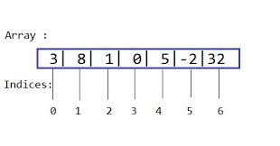
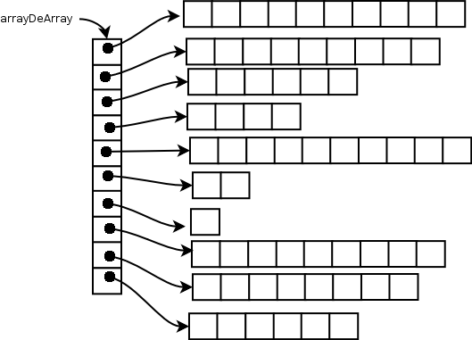

# O que são Arrays?

Os arrays ou matrizes, como são conhecidos pelo Java, fazem parte do pacote java.util na coleção da API do Java. São objetos de recipientes que contém um número fixo de valores de um único tipo. O comprimento de um array é estabelecido quando criado, sendo que após a criação o seu comprimento fica fixo.

Cada item em um array é chamado de elemento, e cada elemento é acessado pelo número, o índice. Abaixo é mostrado se dá esse acesso aos seus elementos, lembrando que sempre sua numeração começa em 0.




# Declarando Arrays

Na declaração de um array, cada elemento recebe um valor padrão, sendo 0 ***(zero)*** para números de tipo primitivo, falso ***(false)*** para elementos booleanos e nulo ***(null)*** para referências. O programa que está na Listagem 1, cria um array de inteiros, coloca alguns valores nela, e imprime cada valor à saída padrão.

```java
public class Declaracao_Array {
    public static void main(String[] args) {
        //[] - são inseridos em uma variável que referecia um array
        int[] a = new int[4];
        //OUTRA MANEIRA DE FAZER UMA DECLARAÇÃO DE ARRAY
        int[] b;
        b = new int[10];
        //DECLARANDO VÁRIOS ARRAYS
        int[] r = new int[44], k = new int[23];

//{} - inicializar valores em um array sua declaração
        int[] iniciaValores = {12,32,54,6,8,89,64,64,6};

//DECLARA UM ARRAY DE INTEIROS
        int[] meuArray;

        //ALOCA MEMÓRIA PARA 10 INTEIROS
        meuArray = new int[10];

        //INICIALIZA O PRIMEIRO ELEMENTO
        meuArray [0] = 100;
        meuArray [1] = 85;
        meuArray [2] = 88;
        meuArray [3] = 93;
        meuArray [4] = 123;
        meuArray [5] = 952;
        meuArray [6] = 344;
        meuArray [7] = 233;
        meuArray [8] = 622;
        meuArray [9] = 8522;
        //meuArray [10] = 564; //ESTOURA A PILHA POIS NÃO EXISTE O ÍNDICE 10

        System.out.println(meuArray[9]);
        System.out.println(meuArray[2]);
    }
}
```

# Descobrindo o tamanho de um array

Por padrão, cada array sabe seu próprio tamanho, independente de quantos valores forem inseridos. O array armazena na variável de instância o método length, que retorna o tamanho do array especificado, conforme o exemplo da Listagem 2.

```java
public class TamanhoArray {

    public static void main(String[] args) {
        int[] arrayUm = {12,3,5,68,9,6,73,44,456,65,321};
        int[] arrayDois = {43,42,4,8,55,21,2,45};

        if(arrayDois.length > 8){
            System.out.println("Tamanho do ArrayDois - Maior que 8!");
        }else{
            System.out.println("Tamanho do ArrayDois - Menor que 8!");
        }
        System.out.println("\nTamanho do ArrayUm = "+arrayUm.length);
    }
}
```

# Inicializando um array

Quando inicializamos um array no momento da declaração, é vista uma lista de valores separados por vírgula dispostos entre chaves { }.

No exemplo da Listagem 3, os valores de cada índice não vão ser impressos porque apenas é inicializado e atribuído o tamanho que o array irá ter. Já na Listagem 4, os valores são previamente definidos e, por isso, serão apresentados na tela.

```java
public class Criando_Inicializando_Array {
  public static void main(String[] args) {
   //ARRAY COM 10 ELEMENTOS
   int[] arrayBase;
   arrayBase = new int[ 20 ];
   System.out.printf("%s %10s \n", "Index", "Valores");
   //GERA A SAÍDA DO VALOR DE CADA ELEMENTO DO ARRAY
   for(int i = 0; i < arrayBase.length; i++)
    System.out.printf("%3d %10d \n", i, arrayBase[ i ]);
   }
}
```
```java
public class Inicializando_Array {
    public static void main(String[] args) {
        //LISTA  DE VALORES
        int[] array = {10, 20, 30, 40, 50, 60, 70, 80, 90, 100, 110};
        System.out.printf("%s %12s \n", "Index", "Valores");
        //PERCORRE CADA ELEMENTO E IMPRIME O ÍNDICE COM O VALOR
        for( int counter = 0; counter < array.length; counter ++){
            System.out.printf("%5d %4s %4d \n", counter, "=>" , array[ counter ]);
        }
    }
}
```

16
16

Marcar como lido

Anotar

Imprimir
Guia do artigo: Arrays em Java
O que são Arrays?
Declarando Arrays
Descobrindo o tamanho de um Array
Inicializando um Array
Percorrendo Arrays
Arrays multidimensionais
Conclusão
O que são Arrays?
Os arrays ou matrizes, como são conhecidos pelo Java, fazem parte do pacote java.util na coleção da API do Java. São objetos de recipientes que contém um número fixo de valores de um único tipo. O comprimento de um array é estabelecido quando criado, sendo que após a criação o seu comprimento fica fixo.

Cada item em um array é chamado de elemento, e cada elemento é acessado pelo número, o índice. Abaixo é mostrado se dá esse acesso aos seus elementos, lembrando que sempre sua numeração começa em 0.

Um array de 5 elementos
Figura 1: Um array de 5 elementos
Declarando Arrays
Na declaração de um array, cada elemento recebe um valor padrão, sendo 0 (zero) para números de tipo primitivo, falso (false) para elementos booleanos e nulo (null) para referências. O programa que está na Listagem 1, cria um array de inteiros, coloca alguns valores nela, e imprime cada valor à saída padrão.

Listagem 1: Declaração de arrays.
1
2
3
4
5
6
7
8
9
10
11
12
13
14
15
16
17
18
19
20
21
22
23
24
25
26
27
28
29
30
31
32
33
34
35
36
public class Declaracao_Array {
    public static void main(String[] args) {
        //[] - são inseridos em uma variável que referecia um array
        int[] a = new int[4];
        //OUTRA MANEIRA DE FAZER UMA DECLARAÇÃO DE ARRAY
        int[] b;
        b = new int[10];
        //DECLARANDO VÁRIOS ARRAYS
        int[] r = new int[44], k = new int[23];

//{} - inicializar valores em um array sua declaração
        int[] iniciaValores = {12,32,54,6,8,89,64,64,6};

//DECLARA UM ARRAY DE INTEIROS
        int[] meuArray;

        //ALOCA MEMÓRIA PARA 10 INTEIROS
        meuArray = new int[10];

        //INICIALIZA O PRIMEIRO ELEMENTO
        meuArray [0] = 100;
        meuArray [1] = 85;
        meuArray [2] = 88;
        meuArray [3] = 93;
        meuArray [4] = 123;
        meuArray [5] = 952;
        meuArray [6] = 344;
        meuArray [7] = 233;
        meuArray [8] = 622;
        meuArray [9] = 8522;
        //meuArray [10] = 564; //ESTOURA A PILHA POIS NÃO EXISTE O ÍNDICE 10

        System.out.println(meuArray[9]);
        System.out.println(meuArray[2]);
    }
}
Descobrindo o tamanho de um array
Por padrão, cada array sabe seu próprio tamanho, independente de quantos valores forem inseridos. O array armazena na variável de instância o método length, que retorna o tamanho do array especificado, conforme o exemplo da Listagem 2.

Saiba mais: Cursos de Java

Listagem 2: Verificando o tamanho de uma array.
1
2
3
4
5
6
7
8
9
10
11
12
13
14
public class TamanhoArray {

    public static void main(String[] args) {
        int[] arrayUm = {12,3,5,68,9,6,73,44,456,65,321};
        int[] arrayDois = {43,42,4,8,55,21,2,45};

        if(arrayDois.length > 8){
            System.out.println("Tamanho do ArrayDois - Maior que 8!");
        }else{
            System.out.println("Tamanho do ArrayDois - Menor que 8!");
        }
        System.out.println("\nTamanho do ArrayUm = "+arrayUm.length);
    }
}
Inicializando um array
Quando inicializamos um array no momento da declaração, é vista uma lista de valores separados por vírgula dispostos entre chaves { }.

No exemplo da Listagem 3, os valores de cada índice não vão ser impressos porque apenas é inicializado e atribuído o tamanho que o array irá ter. Já na Listagem 4, os valores são previamente definidos e, por isso, serão apresentados na tela.

Listagem 3: inicialização sem valor array.
1
2
3
4
5
6
7
8
9
10
11
public class Criando_Inicializando_Array {
  public static void main(String[] args) {
   //ARRAY COM 10 ELEMENTOS
   int[] arrayBase;
   arrayBase = new int[ 20 ];
   System.out.printf("%s %10s \n", "Index", "Valores");
   //GERA A SAÍDA DO VALOR DE CADA ELEMENTO DO ARRAY
   for(int i = 0; i < arrayBase.length; i++)
    System.out.printf("%3d %10d \n", i, arrayBase[ i ]);
   }
}
Listagem 4: Inicializando array com valores.
1
2
3
4
5
6
7
8
9
10
11
public class Inicializando_Array {
    public static void main(String[] args) {
        //LISTA  DE VALORES
        int[] array = {10, 20, 30, 40, 50, 60, 70, 80, 90, 100, 110};
        System.out.printf("%s %12s \n", "Index", "Valores");
        //PERCORRE CADA ELEMENTO E IMPRIME O ÍNDICE COM O VALOR
        for( int counter = 0; counter < array.length; counter ++){
            System.out.printf("%5d %4s %4d \n", counter, "=>" , array[ counter ]);
        }
    }
}

# Percorrendo Arrays
A instrução for aprimorado, como é conhecida, serve para obter elementos de um array, sem a possibilidade de alterá-los. Se caso houver necessidade de modificar os elementos, isso pode ser feito com a instrução for controlada por contador.

Na sintaxe do for aprimorado é divida pelos seguintes parâmetros:

O tipo com um identificador (parâmetro);
O nome do array no qual serão feitas as iterações.

```java
for ( parâmetro : nomeDoArray )
    instrução
```

# Arrays multidimensionais

Esse tipo de array é declarado como tendo duas dimensões e é usado para representar tabelas de valores que consistem em informações organizadas em linhas e colunas.

Os arrays bidimensionais precisam de dois índices para identificar um elemento particular.

Por exemplo, quando um array é identificado dessa forma “numero[indiceA][indiceB]”, a variável numero é o array, o indiceA é a linha e o indiceB é identificado como a coluna, fazendo uma identificação de cada elemento no array por número de linha e coluna.

Exemplo de declaração: int [][] a = { { 1, 2 }, { 2, 2 } };




```java
public class Inicializando_Arrays_Bidimensionais {
    public static void main(String[] args) {

        int[][] array1 = { { 1,2,3 }, { 4, 5, 6 } };
        int[][] array2 = { { 1, 2 }, { 3 }, { 4, 5, 6} };

        System.out.println("Valores no array1 passados na linha são");
        outputArray( array1 ); //exibe o array 2 por linha

        System.out.println("Valores no array2 passados na linha são");
        outputArray( array2 ); //exibe o array 2 por linha

        }
    //FAZ UM LOOP PELAS LINHAS DO ARRAY
    public static void outputArray(int[][] array)
    {
        //FAZ UM LOOP PELAS COLUNAS DA LINHA ATUAL
        for(int linha = 0; linha < array.length; linha++)
        {
            //FAZ LOOP PELAS COLUNAS DA LINHA ATUAL
            for( int coluna = 0; coluna < array[linha].length; coluna++)
                System.out.printf("%d ", array[linha][coluna]);
            System.out.println();
        }
    }
}
```