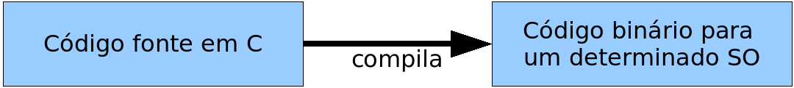
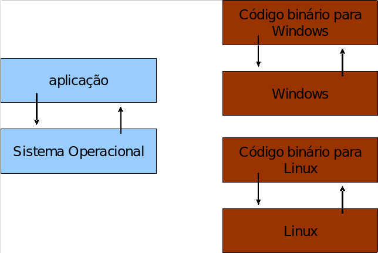
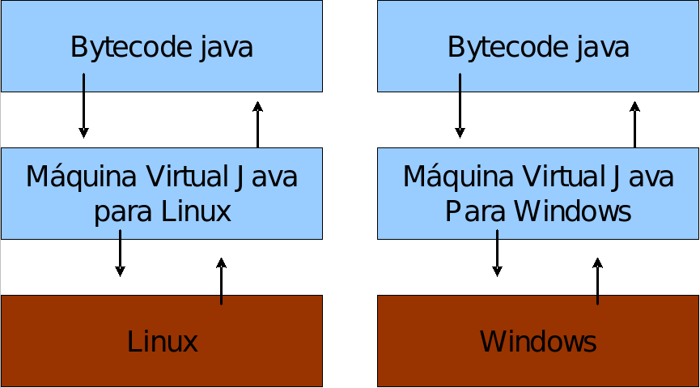

# O que é o Java?

### Quais eram os seus maiores problemas quando programava na década de 1990?

 - ponteiros?
 - gerenciamento de memória?
 - organização?
 - falta de bibliotecas?
 - ter de reescrever parte do código ao mudar de sistema operacional?
 - custo financeiro de usar a tecnologia?

### Talvez toda a lista acima e muitos outros...

O ***Java*** foi criado pela antiga Sun Microsystems e mantida através de um comitê (http://www.jcp.org). Seu site principal era o java.sun.com, e java.com um site mais institucional, voltado ao consumidor de produtos e usuários leigos, não desenvolvedores. Com a compra da Sun pela Oracle em 2009, muitas URLs e nomes tem sido trocados para refletir a marca da Oracle.

### Uma breve história do Java
A Sun criou um time (conhecido como Green Team) para desenvolver inovações tecnológicas em 1992. Esse time foi liderado por James Gosling, considerado o pai do Java. O time voltou com a ideia de criar um interpretador (já era uma máquina virtual, veremos o que é isso mais a frente) para pequenos dispositivos, facilitando a reescrita de software para aparelhos eletrônicos, como vídeo cassete, televisão e aparelhos de TV a cabo.

***"Hoje, sabemos que o Java domina o mercado de aplicações para celulares com mais de 2.5 bilhões de dispositivos compatíveis, porém em 1994 ainda era muito cedo para isso".***

## Máquina Virtual
Em uma linguagem de programação como C e Pascal, temos a seguinte situação quando vamos compilar um programa:

 fonte: Caelum

O código fonte é compilado para código de máquina específico de uma plataforma e sistema operacional. Muitas vezes o próprio código fonte é desenvolvido visando uma única plataforma!

Esse código executável (binário) resultante será executado pelo sistema operacional e, por esse motivo, ele deve saber conversar com o sistema operacional em questão.

fonte: Caelum

### ***"Precisamos reescrever um mesmo pedaço da aplicação para diferentes sistemas operacionais, já que eles não são compatíveis".***

Já o Java utiliza do conceito de máquina virtual, onde existe, entre o sistema operacional e a aplicação, uma camada extra responsável por "traduzir" - mas não apenas isso - o que sua aplicação deseja fazer para as respectivas chamadas do sistema operacional onde ela está rodando no momento:

Essa camada, a máquina virtual, não entende código java, ela entende um código de máquina específico. Esse código de máquina é gerado por um compilador java, como o javac, e é conhecido por ***"bytecode"***, pois existem menos de 256 códigos de operação dessa linguagem, e cada "opcode" gasta um byte.

O compilador Java gera esse bytecode que, diferente das linguagens sem máquina virtual, vai servir para diferentes sistemas operacionais, já que ele vai ser ***"traduzido"*** pela ***JVM***.