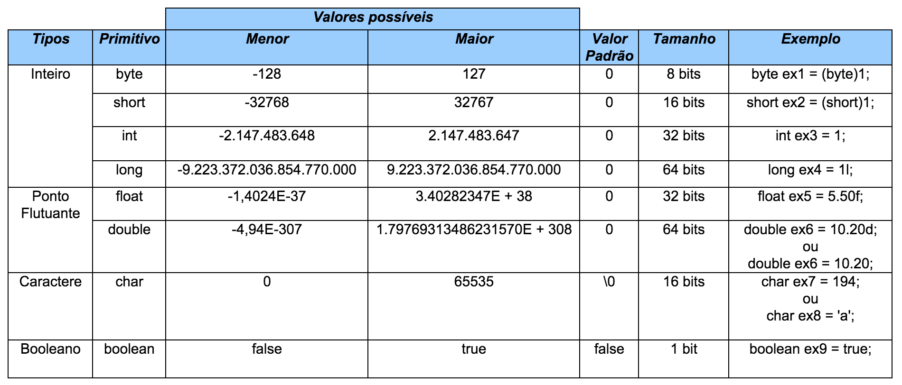
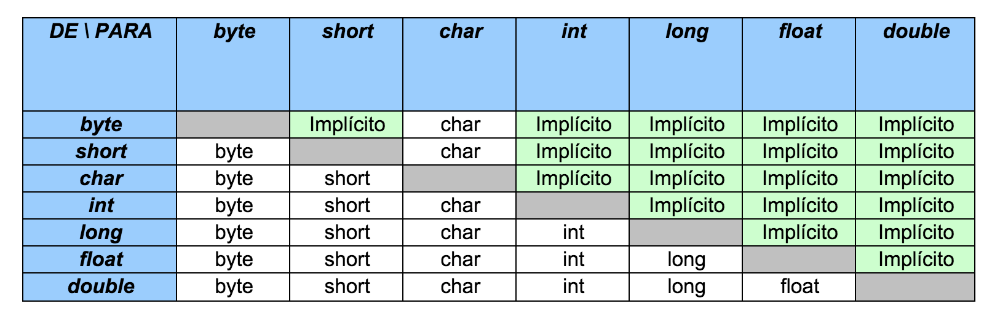

# Variáveis primitivas e Controle de fluxo

Aprenderemos a trabalhar com os seguintes recursos da linguagem Java:

- declaração
- atribuição de valores
- casting
- comparação de variáveis
- controle de fluxo através de if e else
- instruções de laço for e while,
- controle de fluxo com break e continue.

## Declarando e usando variáveis

Dentro de um bloco, podemos declarar variáveis e usá-las. Em Java, toda variável tem um tipo que não pode ser mudado, uma vez que declarado:

***tipoDaVariavel nomeDaVariavel***;

Por exemplo, é possível ter uma idade que guarda um número inteiro:

```java
int idade;

```

Com isso, você declara a variável idade, que passa a existir a partir daquela linha. Ela é do tipo int, que guarda um número inteiro. A partir daí, você pode usá-la, primeiramente atribuindo valores.

A linha a seguir é a tradução de: "idade deve valer quinze".

```java
idade = 15;
```

## Comentários em Java

Para fazer um comentário em java, você pode usar o ***//*** para comentar até o final da linha, ou então usar o /* */ para comentar o que estiver entre eles.

```java
    /* comentário daqui,
    ate aqui */

    // uma linha de comentário sobre a idade
    int idade;
```

Além de atribuir, você pode utilizar esse valor. O código a seguir declara novamente a variável idade com valor 15 e imprime seu valor na saída padrão através da chamada a System.out.println.

```java

// declara a idade
int idade;

idade = 15;

// imprime a idade
System.out.println(idade);

```
### Executar código

Por fim, podemos utilizar o valor de uma variável para algum outro propósito, como alterar ou definir uma segunda variável. O código a seguir cria uma variável chamada idadeNoAnoQueVem com valor de idade mais um.

// calcula a idade no ano seguinte
int idadeNoAnoQueVem;
idadeNoAnoQueVem = idade + 1;
No mesmo momento que você declara uma variável, também é possível inicializá-la por praticidade:

int idade = 15;
Você pode usar os operadores +, -, / e para operar com números, sendo eles responsáveis pela adição, subtração, divisão e multiplicação, respectivamente. Além desses operadores básicos, há o operador % (módulo) que nada mais é que o *resto de uma divisão inteira. Veja alguns exemplos:

```java
int quatro = 2 + 2;
int tres = 5 - 2;

int oito = 4 * 2;
int dezesseis = 64 / 4;

int um = 5 % 2; // 5 dividido por 2 dá 2 e tem resto 1;
                // o operador % pega o resto da divisão inteira
```
 Outro tipo de variável muito utilizado é o **double**, que armazena um número com ponto **flutuante** (e que também pode armazenar um número inteiro).

```java
double pi = 3.14;
double x = 5 * 10;
```

O tipo boolean armazena um valor **verdadeiro(true)** ou **falso(false)**.

```java
boolean verdade = true;
```

O **true e false** são palavras reservadas do Java. É comum que um boolean seja determinado através de uma expressão booleana, isto é, um trecho de código que retorna um booleano, como o exemplo:

```java
int idade = 30;
boolean menorDeIdade = idade < 18;
```

O tipo **char** guarda um, e apenas um, caractere. Esse caractere deve estar entre aspas simples. Não se esqueça dessas duas características de uma variável do tipo char!

### Por exemplo, ela não pode guardar um código como '' pois o vazio não é um caractere!

```java
char letra = 'a';
System.out.println(letra);
```

Variáveis do tipo char são pouco usadas no dia a dia. Veremos mais a frente o uso das **Strings**, que usamos constantemente, porém estas não são definidas por um tipo primitivo.

## Casting e promoção
Alguns valores são incompatíveis se você tentar fazer uma atribuição direta. Enquanto um número real costuma ser representado em uma variável do tipo double, tentar atribuir ele a uma variável int não funciona porque é um código que diz: "i deve valer d", mas não se sabe se d realmente é um número inteiro ou não.

```java
double d = 3.1415;
int i = d; // não compila
```

O mesmo ocorre no seguinte trecho:

```java
int i = 3.14;
```

O mais interessante, é que nem mesmo o seguinte código compila:

```java
double d = 5; // ok, o double pode conter um número inteiro
int i = d; // não compila
```

Apesar de 5 ser um bom valor para um int, o compilador não tem como saber que valor estará dentro desse double no momento da execução. Esse valor pode ter sido digitado pelo usuário, e ninguém vai garantir que essa conversão ocorra sem perda de valores.

Já no caso a seguir, é o contrário:
```java
int i = 5;
double d2 = i;
```
O código acima compila sem problemas, já que um double pode guardar um número com ou sem ponto flutuante. Todos os inteiros representados por uma variável do tipo int podem ser guardados em uma variável double, então não existem problemas no código acima.

Às vezes, precisamos que um número quebrado seja arredondado e armazenado num número inteiro. Para fazer isso sem que haja o erro de compilação, é preciso ordenar que o número quebrado seja moldado (casted) como um número inteiro. Esse processo recebe o nome de casting.

```java
double d3 = 3.14;
int i = (int) d3;
```

O casting foi feito para moldar a variável d3 como um int. O valor de i agora é 3.

O mesmo ocorre entre valores int e long.
```java
long x = 10000;
int i = x; // não compila, pois pode estar perdendo informação
```

E, se quisermos realmente fazer isso, fazemos o casting:
```java
long x = 10000;
int i = (int) x;
```

### Abaixo uma tabela dos possíveis valores para os tipos primitivos:


### Abaixo uma tabela dos possíveis castings:


