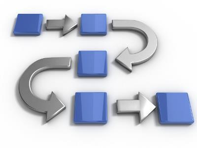

# O que é, e como funciona o algoritmo?

Antes de tudo, vamos compreender o conceito de algoritmo. O termo pode ser entendido como uma sequência de raciocínios, instruções ou operações para alcançar um objetivo, sendo necessário que os passos sejam finitos e operados sistematicamente.

Parece complexo? Calma, vamos simplificar. Alguns exemplos de algoritmos que podemos citar são: receitas culinárias, manual de instrução de aparelhos, funções matemáticas e até mesmo páginas da Web, como esta que você está lendo.

Pense na receita culinária, por exemplo. Ela tem os ingredientes necessários (dados de entrada), passo a passo para realizar a receita (processamento ou instruções lógicas) e atinge um resultado (o prato finalizado). 

Um algoritmo, portanto, conta com a entrada (input) e saída (output) de informações mediadas pelas instruções.

É fundamental compreender que o algoritmo se justifica no resultado que ele almeja alcançar, logo, deve ter um objetivo específico. Uma sequência de instruções simples pode se tornar mais complexa conforme a necessidade de considerar outras situações.

Dessa forma, o algoritmo vai crescendo e ficando mais complexo para englobar todos os cenários possíveis. Quando um programa de computador trava, por exemplo, é porque ele está recebendo informações que não foi programado para processar, ou seja, não foram considerados todos os cenários.

Também é relevante que a estrutura siga uma lógica sistemática. Por exemplo, se você está fazendo um bolo, mas “pula” a etapa de inserir farinha, no final, você não terá mais um bolo.

Com o código, é a mesma coisa, sendo necessário ler linha por linha para que ele atinja o objetivo final. As estruturas de um algoritmo são:

variáveis: são as informações de entrada inseridas que determinam aonde o algoritmo poderá ir. As mais comuns são texto, inteiro, lógico e real;
comandos de repetição: consiste no uso de “se” e “enquanto”, para que o algoritmo saiba o que fazer quando determinados processos ocorrerem e o que fazer se eles mudarem.
Com essas duas estruturas, o algoritmo fica mais completo e capaz de englobar múltiplas situações para permitir que o resultado final seja alcançado.

# Quais os principais benefícios?
Agora que você já entendeu o que é um algoritmo e como, por meio de comandos, ele permite que “A + B + C” resulte em “D”, é preciso conhecer os benefícios proporcionados pela adoção do modelo.

## Mediação
Atualmente, diversas polêmicas estão relacionadas a como as grandes empresas de tecnologia têm usado os algoritmos para impactar a vida das pessoas.

Um dos casos mais famosos é o algoritmo do Facebook, que define o que será exibido no feed de notícias de cada usuário (veremos mais sobre isso a seguir!).

Apesar de muito criticado, pois o algoritmo pode ser alterado para determinados fins, o recurso proporciona uma mediação mais neutra sobre o que é exibido para cada usuário.

Dessa forma, assuntos mais comentados tendem a aparecer para mais pessoas, mas também estão relacionados com preferências, histórico, comportamento etc.

Portanto, um dos benefícios atualmente é que o algoritmo busca fazer essa mediação mais equilibrada entre tudo que está disponível online e filtrar o que é mais relevante de ser exibido.

## Automação
Os programas são compostos por sequências de algoritmos. Dessa forma, é essa sistematização que viabiliza todo tipo de softwares que facilitam a vida e também permitem a automação dos processos.

A partir do Machine Learning, os processos são aprendidos pelas máquinas e reproduzidos, consistindo em um algoritmo complexo que faz a entrada e o processamento dos dados, em que a saída torna-se a entrada de uma estrutura e, assim, sequencialmente, fornecendo lógica e capacidade de aprendizado aos softwares.

## Evolução
A evolução humana nas últimas décadas está totalmente atrelada à ideia de algoritmos. Aparelhos como smartphones, computadores, smart TVs e tablets funcionam com sistemas baseados em algoritmos.

Conforme novos comandos e possibilidades de uso surgem, significa que mais aprimorados e complexos estão os níveis de instrução de um algoritmo.

Assim como a tecnologia em si, as aplicações estão difundidas em diferentes áreas, como marketing, vendas, relacionamento, compras online, logística, financeiro etc.

Um exemplo inédito de uso de um algoritmo é o VITAL, que, desde 2014, faz parte da direção da Deep Knowlegde Ventures, uma empresa de capital de risco de Hong Kong.

Com direito a voto no conselho, o algoritmo faz a recomendações de investimentos após a análise de grandes quantidades de dados e testes clínicos.

Mas também é preciso estar atento ao uso dos algoritmos, principalmente, quando não supervisionados.

Em 2011, uma situação não explicada fez com que o livro “The Making of a Fly”, de Peter Lawrence, alcançasse o valor de 1,7 bilhão de dólares na Amazon e, em seguida, subisse para quase 23,7 bilhões de dólares (mais frete). A empresa, que usa algoritmo para precificação, não conseguiu explicar a anormalidade.

fonte: https://rockcontent.com/blog/algoritmo/